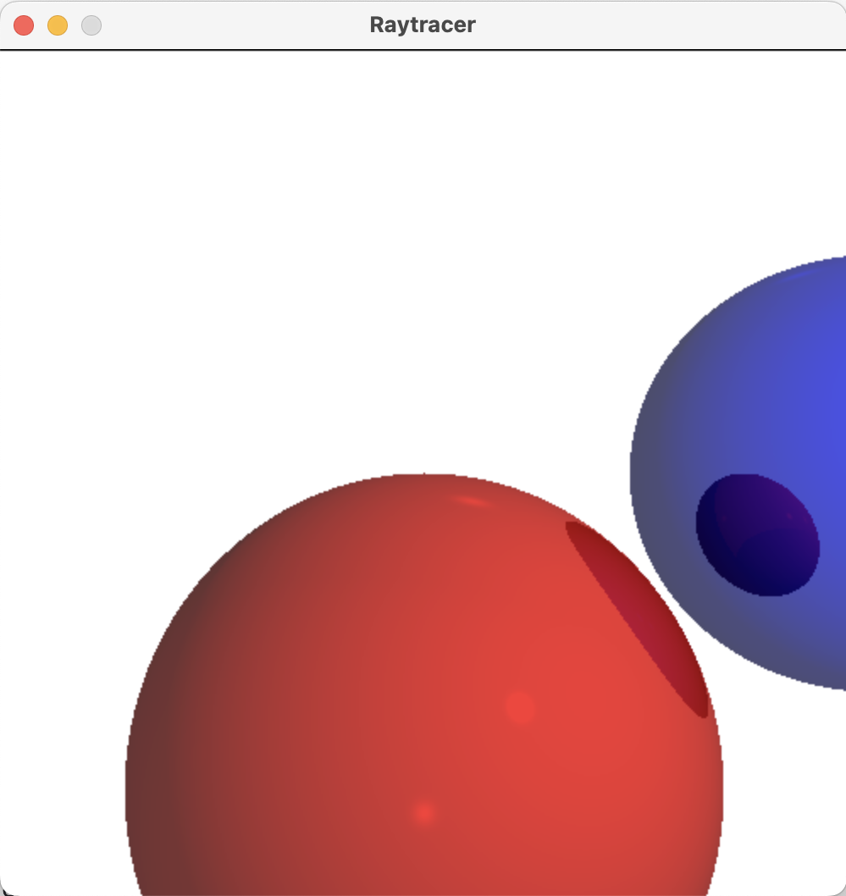

# Raytracer

A Blinn-Phong shaded ray-tracer written in C++

## Usage

`make`  
`./Raytracer`

## Features

- SDL2 Window output
- Blinn-Phong shading
- Reflections
- Refractions
- Sphere geometry

## Example Image

## In Progress

- Triangle geometry
- Basic material system
- Mesh geometry / model loading
